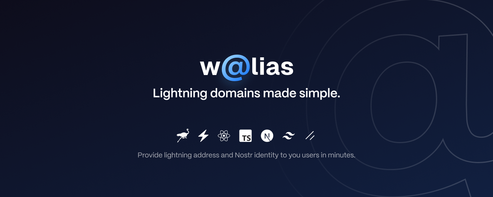

# Walias

Provide Lightning Address and Nostr functionality to your domain without coding.

## Tech stack

- [NextJS](https://nextjs.org/) for web app
- [Tailwind](https://tailwindcss.com/) for style
- [Shadcn](https://ui.shadcn.com/) for UI components
- [Prisma](https://www.prisma.io/) for database ORM
- [Nostr tools](https://github.com/nbd-wtf/nostr-tools) for nostr utils

## Features

- [x] Nostr Login
- [x] REST endpoints
- [x] REST tests
- [x] Frontend frame
- [x] User profile page
- [ ] Connect Frontend with REST Backend
- [x] Wizard installer front
- [ ] Wizard installer backend
- [ ] /.well-known as [Lightning Domain standard](https://github.com/lacrypta/lightning-domains)
- [ ] [NIP05](https://github.com/nostr-protocol/nips/blob/master/05.md) provider
- [ ] [LUD16](https://github.com/lnurl/luds/blob/luds/06.md) provider
- [ ] Multiple [wallet providers](./docs/WALLET_PROVIDERS.md)
- [ ] Nostr profile editor
- [ ] Triggers
- [ ] Dashboard feed
- [ ] Nostr inbox
- [ ] [Email to Nostr](./docs/MAIL_NOSTR.md)

## Getting Started

First, run the development server:

Setup the correct node version using [nvm](https://github.com/nvm-sh/nvm)

```bash
nvm use
```

Install node dependencies using [pnpm](https://pnpm.io/)

```bash
pnpm install
```

Run in development mode

```bash
pnpm dev
```

Open [http://localhost:3000](http://localhost:3000) with your browser to see the result.

You can start editing the page by modifying `app/page.tsx`. The page auto-updates as you edit the file.

This project uses [`next/font`](https://nextjs.org/docs/basic-features/font-optimization) to automatically optimize and load Inter, a custom Google Font.
